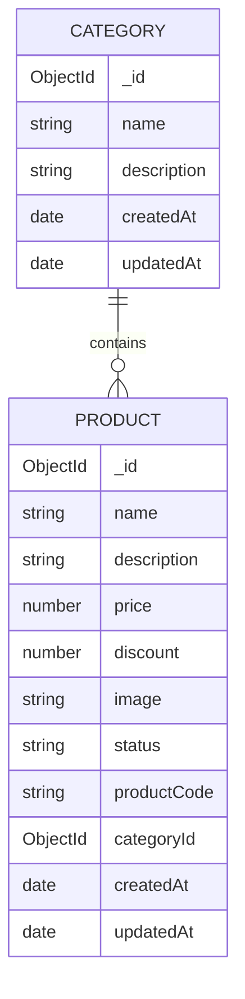

# 6sense Backend Assignment

A RESTful API built with **Node.js**, **Express**, **TypeScript**, and **MongoDB**.

---

## Tech Stack

- **Runtime**: Node.js
- **Framework**: Express.js
- **Language**: TypeScript
- **Database**: MongoDB (Mongoose)
- **Validation**: class-validator + class-transformer

---

## Getting Started

### 1. Install dependencies
```bash
npm install
```

### 2. Configure environment
Create a `.env` file in the root directory:
```env
PORT=3000
HOST=0.0.0.0
MONGODB_URI=mongodb://localhost:27017/6sense
```

### 3. Start MongoDB
```bash
brew services start mongodb/brew/mongodb-community
```

### 4. Run the server
```bash
npm run dev
```

Server starts at: `http://localhost:3000`

---

## API Endpoints

### Base URL
```
http://localhost:3000
```

---

## Category Endpoints

> Create a category first — you need its `_id` to create products.

---

### `POST /category` — Create a Category

**Request Body:**
```json
{
  "name": "Electronics",
  "description": "Electronic gadgets and devices"
}
```

**Response `201`:**
```json
{
  "success": true,
  "message": "Category created successfully",
  "data": {
    "_id": "68043f1a2c4e1a001f3e9abc",
    "name": "Electronics",
    "description": "Electronic gadgets and devices",
    "createdAt": "2026-04-20T00:00:00.000Z",
    "updatedAt": "2026-04-20T00:00:00.000Z"
  }
}
```

---

### `GET /category` — Get All Categories

**Request:** No body, no params.

**Response `200`:**
```json
{
  "success": true,
  "message": "Categories retrieved successfully",
  "count": 1,
  "data": [
    {
      "_id": "68043f1a2c4e1a001f3e9abc",
      "name": "Electronics",
      "description": "Electronic gadgets and devices",
      "createdAt": "2026-04-20T00:00:00.000Z",
      "updatedAt": "2026-04-20T00:00:00.000Z"
    }
  ]
}
```

---

### `GET /category/:id` — Get Category by ID

**URL:** `GET /category/68043f1a2c4e1a001f3e9abc`

**Response `200`:**
```json
{
  "success": true,
  "message": "Category retrieved successfully",
  "data": {
    "_id": "68043f1a2c4e1a001f3e9abc",
    "name": "Electronics"
  }
}
```

---

## Product Endpoints

---

### `POST /product` — Create a Product

**Request Body:**
```json
{
  "name": "Alpha Sorter",
  "description": "A high performance sorting device",
  "price": 100,
  "discount": 10,
  "image": "https://example.com/alpha-sorter.png",
  "status": "In Stock",
  "categoryId": "68043f1a2c4e1a001f3e9abc"
}
```

> - `discount` is optional — defaults to `0` if not provided.
> - `status` must be exactly `"In Stock"` or `"Stock Out"`.
> - `categoryId` must be a valid MongoDB ObjectId of an existing category.
> - `productCode` is **auto-generated** — do not send it.

**Response `201`:**
```json
{
  "success": true,
  "message": "Product created successfully",
  "data": {
    "_id": "68043f2a2c4e1a001f3e9def",
    "name": "Alpha Sorter",
    "description": "A high performance sorting device",
    "price": 100,
    "discount": 10,
    "finalPrice": 90,
    "image": "https://example.com/alpha-sorter.png",
    "status": "In Stock",
    "productCode": "0231dd7-0alport8",
    "categoryId": "68043f1a2c4e1a001f3e9abc",
    "createdAt": "2026-04-20T00:00:00.000Z",
    "updatedAt": "2026-04-20T00:00:00.000Z"
  }
}
```

**Validation Error `400`:**
```json
{
  "error": "Validation failed",
  "details": [
    {
      "field": "status",
      "issues": {
        "isEnum": "Status must be either 'In Stock' or 'Stock Out'"
      }
    }
  ]
}
```

---

### `GET /product` — Get Products with Filters

All query parameters are **optional**.

| Query Param | Description | Example |
|---|---|---|
| `categoryId` | Filter by category | `?categoryId=68043f...` |
| `name` | Search by name (partial, case-insensitive) | `?name=alpha` |

Both can be combined.

**Get all products:**
```
GET /product
```

**Filter by category:**
```
GET /product?categoryId=68043f1a2c4e1a001f3e9abc
```

**Search by name:**
```
GET /product?name=alpha
```

**Both filters together:**
```
GET /product?categoryId=68043f1a2c4e1a001f3e9abc&name=alpha
```

**Response `200`:**
```json
{
  "success": true,
  "message": "Products retrieved successfully",
  "count": 2,
  "data": [
    {
      "_id": "68043f2a2c4e1a001f3e9def",
      "name": "Alpha Sorter",
      "description": "A high performance sorting device",
      "price": 100,
      "discount": 10,
      "finalPrice": 90,
      "image": "https://example.com/alpha-sorter.png",
      "status": "In Stock",
      "productCode": "0231dd7-0alport8",
      "categoryId": "68043f1a2c4e1a001f3e9abc",
      "createdAt": "2026-04-20T00:00:00.000Z",
      "updatedAt": "2026-04-20T00:00:00.000Z"
    }
  ]
}
```

> Both `price` (original) and `finalPrice` (after discount) are always included in the response.

---

### `PATCH /product/:id` — Update a Product

Only `status`, `description`, and `discount` can be updated. All fields are optional — send only what you want to change.

**URL:** `PATCH /product/68043f2a2c4e1a001f3e9def`

**Update all three fields:**
```json
{
  "status": "Stock Out",
  "description": "Updated description",
  "discount": 25
}
```

**Update only status:**
```json
{
  "status": "Stock Out"
}
```

**Update only discount:**
```json
{
  "discount": 20
}
```

**Response `200`:**
```json
{
  "success": true,
  "message": "Product updated successfully",
  "data": {
    "_id": "68043f2a2c4e1a001f3e9def",
    "name": "Alpha Sorter",
    "description": "Updated description",
    "price": 100,
    "discount": 25,
    "finalPrice": 75,
    "status": "Stock Out",
    "productCode": "0231dd7-0alport8",
    "categoryId": "68043f1a2c4e1a001f3e9abc",
    "createdAt": "2026-04-20T00:00:00.000Z",
    "updatedAt": "2026-04-20T00:01:00.000Z"
  }
}
```

**Not Found `404`:**
```json
{
  "success": false,
  "message": "Product with id \"68043f...\" not found"
}
```

---

## Product Code Generation

Product codes are auto-generated from the product name using the following algorithm:

1. Strip non-letter characters and lowercase the name.
2. Find all **longest strictly increasing substrings** (each letter's alphabet value must be greater than the previous).
3. If multiple substrings of equal max length exist, **concatenate** them.
4. Prepend the **starting index** and append the **ending index** (in the letters-only string).
5. Prefix with the first 7 characters of the **MD5 hash** of the original name.

**Format:** `<hash>-<start><substring><end>`

**Example:**

| Input | Letters only | Longest runs | Code body | Final code |
|---|---|---|---|---|
| `"Alpha Sorter"` | `"alphasorter"` | `"alp"` (0–2), `"ort"` (6–8) | `0alport8` | `0231dd7-0alport8` |

---

## Bonus: Data Model Diagram



- One category can have many products.
- Each product belongs to exactly one category.
- `productCode` is unique per product.
